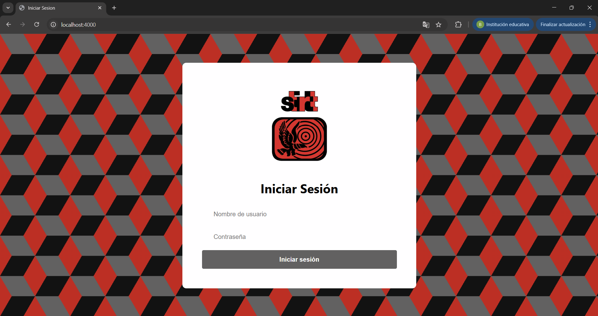

# Sistema de Gestión Documental

Este proyecto es un sistema web para la gestión de información del sindicato.

Para correrlo en la consola de vscode poner:  
`npm run dev`

Luego abrir en el navegador:  
`http://localhost:4000`

credenciales:
user: demo ////
contraseña: demo

Para añadir un evento al calendario - dar click en día deseado

## Capturas del sistema

